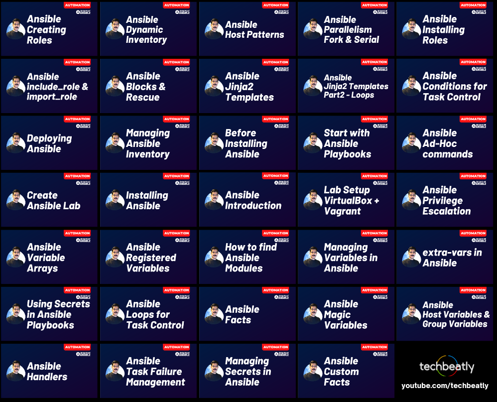

# 30 Days of Ansible Bootcamp

[](LICENSE)
[](https://www.ansible.com/)
[](https://youtu.be/K4wGqwS2RLw?list=PLH5uDiXcw8tSW9Y6FsVsSQJQ88tMPBsbK)

**A comprehensive, hands-on learning journey from Ansible fundamentals to advanced automation techniques.**

Learn Ansible from zero to production-ready skills through a structured 30-day curriculum with video lessons, written documentation, and working code examples.

[](https://youtu.be/K4wGqwS2RLw?list=PLH5uDiXcw8tSW9Y6FsVsSQJQ88tMPBsbK)

## 📺 Video Course

This repository is the companion to the complete video series on the **[techbeatly YouTube Channel](https://www.youtube.com/techbeatly)**.

**[🎬 Watch the Full Ansible Course Playlist](https://youtu.be/K4wGqwS2RLw?list=PLH5uDiXcw8tSW9Y6FsVsSQJQ88tMPBsbK)**

---

## 🎯 Learning Objectives

By completing this 30-day bootcamp, you will:

- ✅ Understand Ansible architecture and core concepts
- ✅ Set up and manage Ansible lab environments
- ✅ Write production-quality playbooks and roles
- ✅ Master variables, facts, and dynamic inventories
- ✅ Implement secrets management with Ansible Vault
- ✅ Use advanced features: loops, conditionals, handlers, blocks
- ✅ Create reusable roles and leverage Ansible Galaxy
- ✅ Apply best practices for real-world automation
- ✅ Build confidence to automate infrastructure at scale

---

## 📚 Prerequisites

### Required Knowledge
- **Linux basics**: Command line navigation, file system, users/permissions
- **SSH fundamentals**: How to connect to remote systems
- **YAML syntax**: Basic understanding of YAML structure
- **Text editor**: Familiarity with vim, nano, or VS Code

### System Requirements
- **Control Node**: Linux, macOS, or WSL2 (Windows)
- **Managed Nodes**: 1-3 Linux systems (VMs, cloud instances, or containers)
- **Ansible Version**: 2.9+ (Core 2.12+ recommended)
- **Python**: 3.6+ on both control and managed nodes
- **Virtualization** (optional): VirtualBox + Vagrant for local labs

### Recommended Setup
- **VirtualBox** 6.1+ and **Vagrant** 2.2+ (for Days 2-4 lab setup)
- At least **4 GB RAM** and **20 GB disk space** for VMs
- Stable internet connection for package downloads

---

## 📖 How to Use This Repository

### Self-Paced Learning
1. **Follow the daily sequence**: Start with Day 01 and progress in order
2. **Watch the video first**: Each day links to the corresponding video lesson
3. **Read the README**: Detailed explanations and concepts for each topic
4. **Run the examples**: Execute playbooks in your lab environment
5. **Experiment**: Modify examples to deepen understanding

### Structure of Each Day
```
Day-XX-Topic-Name/
├── README.md           # Lesson content and explanations
├── site.yaml          # Main example playbook
├── ansible.cfg        # Ansible configuration for this lesson
├── inventory          # Sample inventory file
└── [other files]      # Templates, variables, vault files, etc.
```

### Running Examples

**Navigate to the day's directory:**
```bash
cd Day-09-Playbooks/
```

**Run the playbook:**
```bash
ansible-playbook site.yaml
```

**Or with explicit configuration:**
```bash
ansible-playbook -i inventory site.yaml
```

---

## 📅 30-Day Curriculum

### Week 1: Setup & Fundamentals (Days 1-7)

| Day | Topic | Description |
|-----|-------|-------------|
| [Day 01](Day-01-Introduction-to-Ansible/) | **Introduction to Ansible** | What is Ansible, architecture, use cases |
| [Day 02](Day-02-Setup-Your-Lab-Environment-Using-VirtualBox-and-Vagrant/) | **Lab Environment Setup** | VirtualBox and Vagrant basics |
| [Day 03](Day-03-Ansible-Lab-Environment-Using-VirtualBox-and-Vagrant/) | **Ansible Lab with VirtualBox** | Creating test environments |
| [Day 04](Day-04-Create-Ansible-Lab-using-Vagrant-and-VirtualBox/) | **Vagrant Lab Creation** | Automated VM provisioning |
| [Day 05](Day-05-Installing-Ansible-on-Linux/) | **Installing Ansible** | Installation on various Linux distros |
| [Day 06](Day-06-Deploying-Ansible/) | **Deploying Ansible** | Configuration and first commands |
| [Day 07](Day-07-Managing-Ansible-Inventory/) | **Managing Inventory** | Static and dynamic inventory files |

### Week 2: Core Concepts (Days 8-14)

| Day | Topic | Description |
|-----|-------|-------------|
| [Day 08](Day-08-Running-Ad-Hoc-Commands/) | **Ad-Hoc Commands** | Quick one-liner automation |
| [Day 09](Day-09-Playbooks/) | **Playbooks Fundamentals** | YAML, plays, tasks, and structure |
| [Day 10](Day-10-Remote-User-and-Privilege-Management/) | **Privilege Management** | Remote users, become, sudo |
| [Day 11](Day-11-Find-Modules-to-Use/) | **Finding Modules** | Module documentation and discovery |
| [Day 12](Day-12-Managing-Ansible-Variables/) | **Managing Variables** | Variable basics and scopes |
| [Day 13](Day-13-Ansible-Extra-Variables/) | **Extra Variables** | Runtime variables with -e flag |
| [Day 14](Day-14-Ansible-Host-Variables-and-Group-Variables/) | **Host & Group Variables** | Organizing variables with host_vars and group_vars |

### Week 3: Variables & Data (Days 15-21)

| Day | Topic | Description |
|-----|-------|-------------|
| [Day 15](Day-15-Ansible-Variable-Arrays/) | **Variable Arrays** | Lists, dictionaries, and complex data |
| [Day 16](Day-16-Ansible-Registered-Variables/) | **Registered Variables** | Capturing task output |
| [Day 17](Day-17-Ansible-Facts/) | **Ansible Facts** | System information gathering |
| [Day 18](Day-18-Ansible-Custom-Facts/) | **Custom Facts** | Creating custom local facts |
| [Day 19](Day-19-Ansible-Magic-Variables/) | **Magic Variables** | Built-in variables (hostvars, groups, etc.) |
| [Day 20](Day-20-Ansible-Secrets/) | **Ansible Vault** | Encrypting sensitive data |
| [Day 21](Day-21-Using-Secrets-in-Playbook/) | **Using Secrets** | Vault in production playbooks |

### Week 4: Advanced Control (Days 22-28)

| Day | Topic | Description |
|-----|-------|-------------|
| [Day 22](Day-22-Task-Control-and-Loops/) | **Loops** | Iterating with loop, with_items |
| [Day 23](Day-23-Conditional-Execution/) | **Conditionals** | When statements and logic |
| [Day 24](Day-24-Handlers/) | **Handlers** | Event-driven task execution |
| [Day 25](Day-25-Task-Failures/) | **Task Failure Handling** | Error handling and recovery |
| [Day 26](Day-26-Blocks/) | **Blocks** | Grouping tasks with rescue/always |
| [Day 27](Day-27-Jinja2/) | **Jinja2 Templates** | Dynamic file generation |
| [Day 28](Day-28-Roles/) | **Roles** | Organizing playbooks into reusable components |

### Week 5: Optimization & Patterns (Days 29-30)

| Day | Topic | Description |
|-----|-------|-------------|
| [Day 29](Day-29-Parallelism/) | **Parallelism** | Serial execution, forks, strategies |
| [Day 30](Day-30-Host-Patterns/) | **Host Patterns** | Advanced inventory targeting |

---

## 🎓 Real-World Use Cases

Practical examples demonstrating real automation scenarios:

- **[Use Case: Ansible Variables](Use-Case-Ansible-Variables/)** - Variable management patterns
- **[Use Case: Calling Roles with Variables](Use-Case-Calling-Role-with-Variable/)** - Role parameterization
- **[Use Case: Collect Host Information](Use-Case-Collect-Host-Info/)** - Gathering and reporting system data
- **[Use Case: Modify JSON/YAML](Use-Case-Modify-JSON-YAML/)** - Data manipulation techniques
- **[Use Case: Advanced Vault](Use-Case-Vault-Advanced/)** - Complex secrets management

---

## 🛠️ Lab Environment Options

### Option 1: Local VMs (VirtualBox + Vagrant)
**Best for**: Complete control, offline work, resource-intensive testing

```bash
# Install VirtualBox and Vagrant, then:
vagrant init ubuntu/focal64
vagrant up
```

Covered in: Days 2-4

### Option 2: Cloud VMs
**Best for**: Production-like environments, team collaboration

- AWS EC2, Azure VMs, Google Compute Engine
- DigitalOcean Droplets, Linode instances
- Use free tier options for learning

### Option 3: Containers
**Best for**: Lightweight testing, quick iterations

```bash
docker run -d --name ansible-node1 ubuntu:20.04
```

### Option 4: WSL2 (Windows Users)
**Best for**: Windows users wanting Linux experience

Install WSL2, then install Ansible within your Linux distribution.

---

## 🚀 Quick Start

### 1. Clone the Repository
```bash
git clone https://github.com/ginigangadharan/30-Days-of-Ansible-Bootcamp.git
cd 30-Days-of-Ansible-Bootcamp
```

### 2. Install Ansible
```bash
# On Ubuntu/Debian
sudo apt update
sudo apt install ansible

# On RHEL/CentOS/Fedora
sudo dnf install ansible

# Using pip
pip3 install ansible
```

### 3. Set Up Lab (Optional)
```bash
cd Day-04-Create-Ansible-Lab-using-Vagrant-and-VirtualBox/
vagrant up
```

### 4. Start Learning
```bash
cd Day-01-Introduction-to-Ansible/
cat README.md
```

---

## 📝 Best Practices Taught

Throughout this bootcamp, you'll learn industry best practices:

- ✅ **Idempotency**: Write playbooks that can run multiple times safely
- ✅ **FQCN**: Use Fully Qualified Collection Names (ansible.builtin.*)
- ✅ **Variables**: Proper scoping and organization
- ✅ **Security**: Ansible Vault for secrets management
- ✅ **Error Handling**: Graceful failure management
- ✅ **Roles**: Modular, reusable automation code
- ✅ **Testing**: Syntax checks and validation
- ✅ **Documentation**: Self-documenting playbooks

---

## 🤝 Contributing

Contributions are welcome! Here's how you can help:

1. **Report Issues**: Found a bug or error? [Open an issue](https://github.com/ginigangadharan/30-Days-of-Ansible-Bootcamp/issues)
2. **Suggest Improvements**: Have ideas? Share them in discussions
3. **Submit Pull Requests**: 
   - Fix typos or errors
   - Add examples or use cases
   - Improve documentation
4. **Share Your Experience**: Star ⭐ the repo if you find it helpful

### Contribution Guidelines
- Follow the existing structure and style
- Test playbooks before submitting
- Update READMEs to match code changes
- Keep examples beginner-friendly

---

## 📚 Additional Resources

### Official Documentation
- [Ansible Documentation](https://docs.ansible.com/)
- [Ansible Galaxy](https://galaxy.ansible.com/)
- [Ansible GitHub](https://github.com/ansible/ansible)

### Community
- [Ansible Community Forum](https://forum.ansible.com/)
- [Ansible Reddit](https://www.reddit.com/r/ansible/)
- [IRC: #ansible on libera.chat](https://web.libera.chat/#ansible)

### Related Content
- [techbeatly Blog](https://www.techbeatly.com/)
- [Ansible Best Practices](https://docs.ansible.com/ansible/latest/tips_tricks/ansible_tips_tricks.html)
- [Ansible Lint](https://ansible-lint.readthedocs.io/)

---

## 📄 License

This project is licensed under the MIT License - see the [LICENSE](LICENSE) file for details.

---

## 👨‍💻 Author

**Gineesh Madapparambath**

- YouTube: [techbeatly](https://www.youtube.com/techbeatly)
- Blog: [techbeatly.com](https://www.techbeatly.com/)
- GitHub: [@ginigangadharan](https://github.com/ginigangadharan)

---

## ⭐ Support This Project

If you find this bootcamp helpful:

- ⭐ **Star this repository**
- 📺 **Subscribe to [techbeatly YouTube Channel](https://www.youtube.com/techbeatly)**
- 🔔 **Enable notifications** for new videos
- 💬 **Share with others** learning Ansible
- 🐛 **Report issues** to help improve the content

---

## 🎓 Completion Certificate

After completing all 30 days:
1. Build a real-world automation project using what you've learned
2. Share your project (optional) with the community
3. Consider contributing back to this repository with your use cases

---

## 📊 Repository Stats

- **30 Days** of structured learning
- **30+ Playbooks** ready to run
- **5 Real-world use cases**
- **100% Free** and open source

---

**Happy Learning! 🚀**

*Remember: The best way to learn Ansible is by doing. Don't just read - experiment, break things, fix them, and build real automation!*
